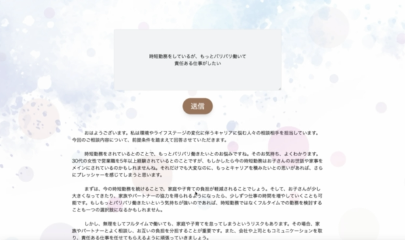
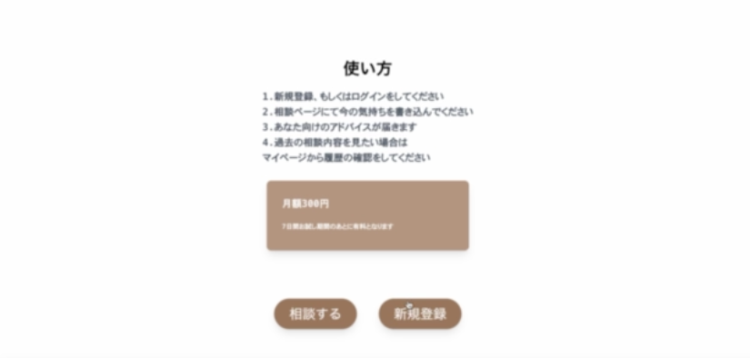
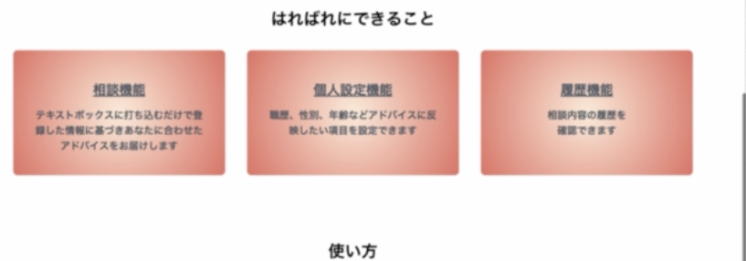
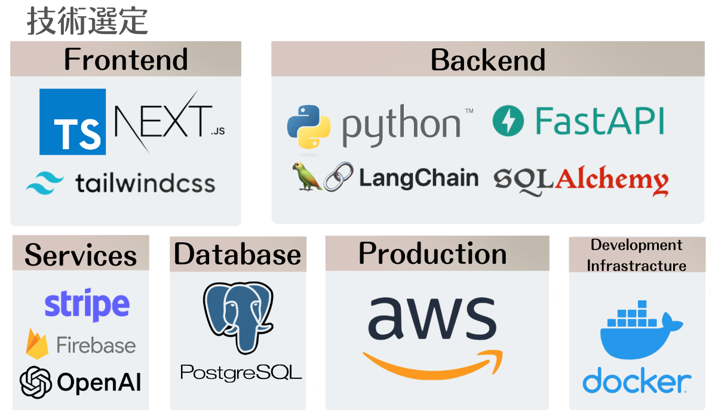
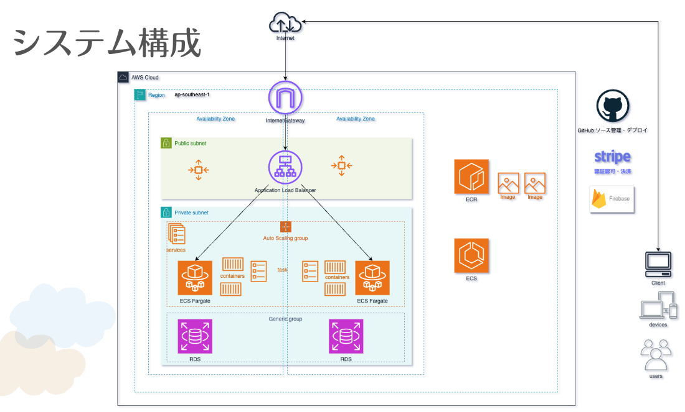

# readme.md

キャリアの悩み相談アプリ

LLM により個別最適化された情報を提供


## Features

- メール認証
- サインアップ、ログイン
- 決済（サブスクリプション）
- マイページ閲覧
- パーソナライズ回答








## Getting Started

1.Clone this repository

```
git clone https://github.com/MsE-BC5/harebare.git
```

2.Move to the root directory

```
cd harebare
```

3.Download dependencies

```
docker compose up -d --build
```

4.Run the App

```
docker-compose up -d
```

5.Open [http://localhost:3000](http://localhost:3000/) with your browser to see the App

## **Built With**

- [Next.js](https://nextjs.org/): 14.0.4
- [TypeScript](https://www.typescriptlang.org/): 4.6.4
- [Python](https://www.python.org/): 3.11.6
- [Node.js](https://nodejs.org/ja/): 20.9.0
- [SQLAlchemy](https://www.sqlalchemy.org/):2.0.25
- [PostgreSQL](https://www.postgresql.org/): 8.0
- [Docker](https://www.docker.com/): 24.0.6
- [Stripe](https://stripe.com/jp):
- [AWS ECS,RDS](https://aws.amazon.com/jp/)



## **Project Structure**



## Author

Harebare.inc
